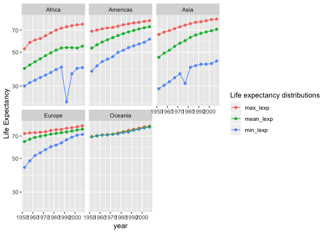
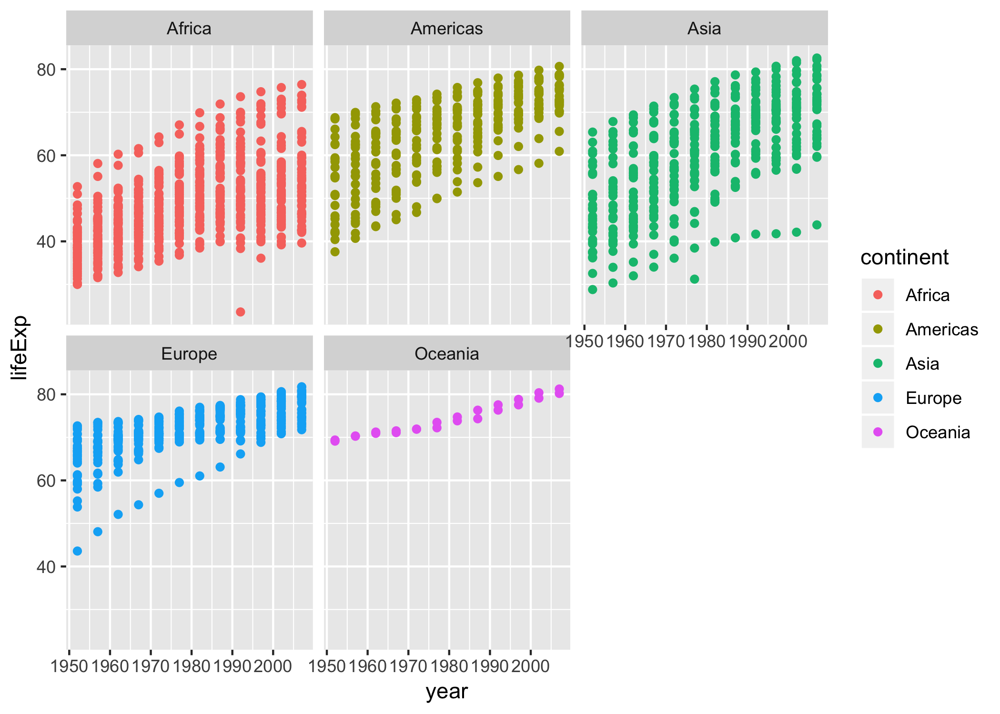
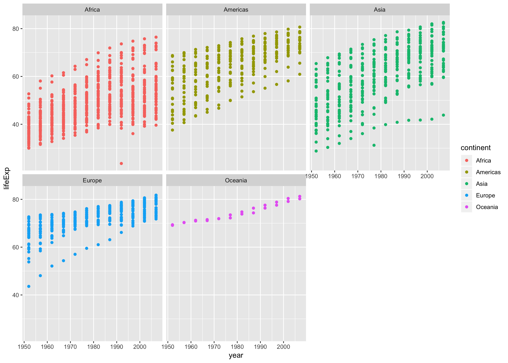
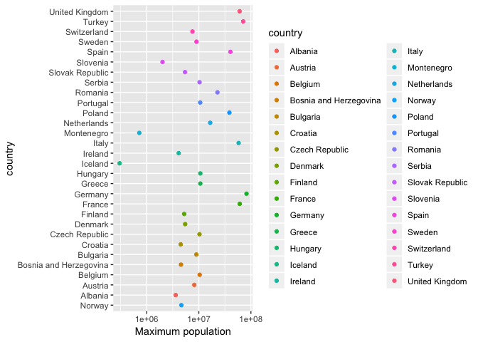
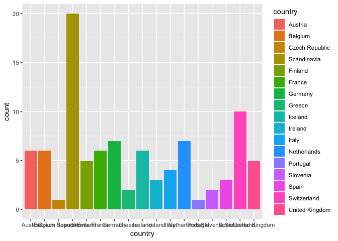

Homework assignment 05
================

``` r
library(gapminder)
library(forcats)
library(ggplot2)
```

    ## Warning: package 'ggplot2' was built under R version 3.4.4

``` r
library(tidyr)
```

    ## Warning: package 'tidyr' was built under R version 3.4.4

``` r
library(dplyr)
```

    ## Warning: package 'dplyr' was built under R version 3.4.4

    ## 
    ## Attaching package: 'dplyr'

    ## The following objects are masked from 'package:stats':
    ## 
    ##     filter, lag

    ## The following objects are masked from 'package:base':
    ## 
    ##     intersect, setdiff, setequal, union

``` r
library(plotly)
```

    ## 
    ## Attaching package: 'plotly'

    ## The following object is masked from 'package:ggplot2':
    ## 
    ##     last_plot

    ## The following object is masked from 'package:stats':
    ## 
    ##     filter

    ## The following object is masked from 'package:graphics':
    ## 
    ##     layout

``` r
library(readr)
```

Part 1: Factor Rearrangement
============================

Drop Oceania.
-------------

Some information about the data set prior to change:

``` r
# number of rows and levels of data set
(nrow(gapminder))
```

    ## [1] 1704

``` r
(nlevels(gapminder))
```

    ## [1] 0

Dropping Oceania:

``` r
gap_drop <- gapminder %>% 
  filter(continent != 'Oceania')
```

    ## Warning: package 'bindrcpp' was built under R version 3.4.4

``` r
#display same information after dropped factor
(nrow(gap_drop))
```

    ## [1] 1680

``` r
(nlevels(gap_drop$continent))
```

    ## [1] 5

Unused levels are still present. We can remove these by using $:

``` r
gap_drop_levels <- gap_drop %>% 
  droplevels()

#display same information after dropped unused levels
(nrow(gap_drop_levels))
```

    ## [1] 1680

``` r
(nlevels(gap_drop_levels$continent))
```

    ## [1] 4

Reorder the levels of country or continent
------------------------------------------

The data is by default ordered alphabetically. Let us instead order the countries by minimum population using `fct_reorder`:

``` r
reordered_cntry <- fct_reorder(gap_drop_levels$country, gap_drop_levels$pop, min) 

reordered_cntry %>% 
  levels() %>% 
  head(5) %>% 
  knitr::kable()
```

| x                     |
|:----------------------|
| Sao Tome and Principe |
| Djibouti              |
| Bahrain               |
| Iceland               |
| Comoros               |

We can check whether this is correct by manually calculating the minimum population through the years:

``` r
gap_drop_levels %>% 
  group_by(country) %>% 
  summarize(min_p = min(pop)) %>% 
  arrange(min_p) %>% 
  head(5) %>% 
  knitr::kable()
```

| country               |  min\_p|
|:----------------------|-------:|
| Sao Tome and Principe |   60011|
| Djibouti              |   63149|
| Bahrain               |  120447|
| Iceland               |  147962|
| Comoros               |  153936|

Which yields the same answer.

Let us order `continent` by life expectancy:

``` r
reordered_cont <- fct_reorder(gap_drop_levels$continent, gap_drop_levels$lifeExp, min) 

reordered_cont %>% 
  levels() %>% 
  head(5) %>% 
  knitr::kable()
```

| x        |
|:---------|
| Africa   |
| Asia     |
| Americas |
| Europe   |

And manually:

``` r
gap_drop_levels %>% 
  group_by(continent) %>% 
  summarize(min_e = min(lifeExp)) %>% 
  arrange(min_e) %>% 
  head(5) %>% 
  knitr::kable()
```

| continent |  min\_e|
|:----------|-------:|
| Africa    |  23.599|
| Asia      |  28.801|
| Americas  |  37.579|
| Europe    |  43.585|

Part 2: File I/O
================

Let us first create a variable we can experiment with:

``` r
exp_data <- gapminder %>% 
  mutate(continent_redord = fct_reorder(continent, lifeExp, min)) %>% 
  group_by(continent_redord) %>%
  summarize(min_lifeExp = min(lifeExp))

str(exp_data)
```

    ## Classes 'tbl_df', 'tbl' and 'data.frame':    5 obs. of  2 variables:
    ##  $ continent_redord: Factor w/ 5 levels "Africa","Asia",..: 1 2 3 4 5
    ##  $ min_lifeExp     : num  23.6 28.8 37.6 43.6 69.1

``` r
exp_data
```

    ## # A tibble: 5 x 2
    ##   continent_redord min_lifeExp
    ##   <fct>                  <dbl>
    ## 1 Africa                  23.6
    ## 2 Asia                    28.8
    ## 3 Americas                37.6
    ## 4 Europe                  43.6
    ## 5 Oceania                 69.1

Write\_csv()/read\_csv()
------------------------

Let us first try to write the data to file

``` r
write_csv(exp_data, "test_write_to_csv.csv")
```

And then to read from file:

``` r
data_csv <- read_csv("test_write_to_csv.csv")
```

    ## Parsed with column specification:
    ## cols(
    ##   continent_redord = col_character(),
    ##   min_lifeExp = col_double()
    ## )

``` r
data_csv
```

    ## # A tibble: 5 x 2
    ##   continent_redord min_lifeExp
    ##   <chr>                  <dbl>
    ## 1 Africa                  23.6
    ## 2 Asia                    28.8
    ## 3 Americas                37.6
    ## 4 Europe                  43.6
    ## 5 Oceania                 69.1

We observe that the new column `continent_redord` no longer is a factor, but a character.

saveRDS()/readRDS()
-------------------

Let us try to do the same thing, using the saveRDS() and readRDS():

``` r
saveRDS(exp_data, "test_save_to_rds.rds")
```

And then read from .rbs:

``` r
data_rds <- readRDS("test_save_to_rds.rds")
data_rds
```

    ## # A tibble: 5 x 2
    ##   continent_redord min_lifeExp
    ##   <fct>                  <dbl>
    ## 1 Africa                  23.6
    ## 2 Asia                    28.8
    ## 3 Americas                37.6
    ## 4 Europe                  43.6
    ## 5 Oceania                 69.1

dput()/dget()
-------------

Can also use dput()/dget():

``` r
dput(exp_data, "data_txt.txt")
```

``` r
data_txt <- dget("data_txt.txt")
data_txt
```

    ## # A tibble: 5 x 2
    ##   continent_redord min_lifeExp
    ##   <fct>                  <dbl>
    ## 1 Africa                  23.6
    ## 2 Asia                    28.8
    ## 3 Americas                37.6
    ## 4 Europe                  43.6
    ## 5 Oceania                 69.1

Part 3: Visualization design
============================

Let us make a figure based on some basic functions. Want to make a plot that shows how life expectancy has changed throughout the years per continent:

``` r
lexp_cont <- gapminder %>% 
  ggplot(aes(year, lifeExp)) +
  geom_point() +  #just to make things harder to interpret. Might as well use geom_smooth or geom_line
  aes(color = continent) + 
  facet_wrap(~continent) #showing all continents
lexp_cont
```


Instead, let us use some new techniques to obtain a nicer and more informative plot.

Let us first filter out some of the information that might be useful. We want to display some interesting facts about the life expectancy, like mean, max and min for each of the continents.

``` r
filtered_data <- gapminder %>% 
  group_by(year, continent) %>% 
  summarize(min_lexp = min(lifeExp),
            max_lexp = max(lifeExp),
            mean_lexp = mean(lifeExp)) %>% 
  gather(key = "lexp_att", value = "lexp_val", min_lexp, max_lexp, mean_lexp)

lexp_new <- filtered_data %>% 
  ggplot(aes(year, lexp_val, group = lexp_att, color = lexp_att)) +
  scale_y_log10() + 
  geom_point() +
  geom_line() +
  facet_wrap(~continent) + 
  scale_color_discrete("Life expectancy distributions") +
  ylab("Life Expectancy")

lexp_new
```



We see that the way the data is displayed is more informative this way, with lines showing the change in life expectancy per year per continent. This way, the trends are more visible and interpretable.

Plotly
------

Differences:

-   `Plotly` creates reactive plots where you would be able to hover your mouse over the plots to see data values and information, zoom in and out of regions as well as better customization of plots, e.g. color arrangements.
-   ggplots may also be converted into plotly plots.
-   There is also a floating toolbar for additional options and interactions.

This means that `plotly` in general is ment for making web-based graphs.

Let us see how we can apply the plotly function to our new plot:

``` r
#not viewable in document
#ggplotly(lexp_new)
```

Part 4: Writing figures to file
===============================

Use of ggsave()
---------------

To save figures to a file, we could use the function `ggsave()`. This function has several parameters, like `width`, `height`, `scale`, `dpi`, making it possible to tune the image one wants to save to file. When desired plot is not specified, last plot displayed will be saved.

Saving an arbitrary plot
------------------------

``` r
#Save old plot

ggsave("./ggsave_figs/old_plot_img.png", plot = lexp_cont)
```

    ## Saving 7 x 5 in image

Dimensions
----------

``` r
#default would save the file with the same dimensions as the original plot

ggsave(plot= lexp_cont, "./ggsave_figs/default_img.png")
```

    ## Saving 7 x 5 in image

``` r
#fixed dimensions height and width:
ggsave(plot = lexp_new,"./ggsave_figs/fixed_dim_img.png", width = 10, height = 15)

#scale

ggsave(plot = lexp_new,"./ggsave_figs/scale_img.png", scale = 1.5)
```

    ## Saving 10.5 x 7.5 in image

Display images using image linking:

Default plot: 

and

scaled plot:



Resolution
----------

``` r
#fixed resolution, high:

ggsave("./ggsave_figs/high_dpi_img.png", dpi = 400)
```

    ## Saving 7 x 5 in image

``` r
#fixed resolution, low:

ggsave("./ggsave_figs/low_dpi_img.png", dpi = 10)
```

    ## Saving 7 x 5 in image

Graphics devices
----------------

``` r
#Vector format
ggsave("./ggsave_figs/eps_img.png", device = "eps")
```

    ## Saving 7 x 5 in image

``` r
#Bmp format
ggsave("./ggsave_figs/bmp_img.png", device = "bmp")
```

    ## Saving 7 x 5 in image

But I want to do more
=====================

The `forcats` package includes the following functions to work with reordering factor levels:

-   `fct_relevel()`;
-   `fct_reorder2()`;
-   `fct_infreq()` and `fct_rev()`;
-   `fct_recode()`;
-   `fct_collapse()`; and
-   `fct_lump()`.

Let us try some of them:

`fct_relevel()` can be used to manually reorder levels. Let us create a plot for the population counts in Europa, and move *Norway* to the top (which would mean last entry).

``` r
#filter continent and grouping by country, max population:

gapminder %>% 
  filter(continent == "Europe") %>% 
  group_by(country) %>% 
  summarize(
    max_pop = max(pop)) %>% 
  arrange(max_pop) %>%
  ggplot(aes(max_pop, fct_relevel(country, "Norway"), color = country)) +
  geom_point() + 
  scale_x_log10() +
  xlab("Maximum population") +
  ylab("country")
```



`fct_collapse()`
----------------

`fct_collapse()` can be used to manually combine levels into groups. Let us combine all scandinavian countries into one group. Plotting countries in Europe with number of gdpPercap over 20000.:

``` r
gapminder %>% 

  filter(continent == "Europe") %>% 
  
  filter(gdpPercap > 20000) %>% 
  
  mutate(country = country %>% 
      fct_collapse(
        "Scandinavia" = c("Norway", "Sweden", "Denmark")
      )
  ) %>% 
  ggplot(aes(x = country, fill = country)) +
  geom_bar()
```

 \`\`\`
